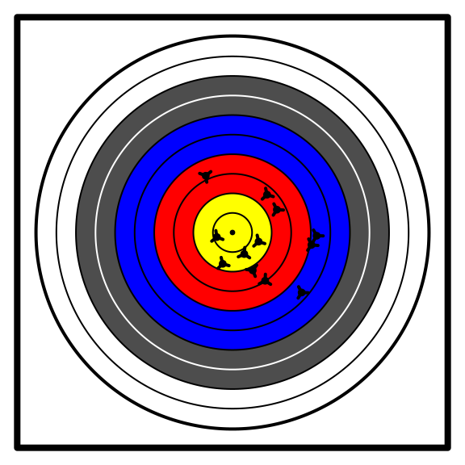
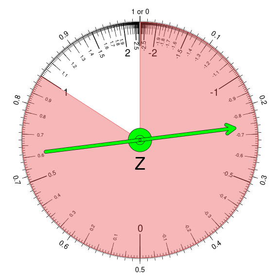

I am making open-source introductory statistics materials. You can see a [preview of my questions](https://ceworley.github.io/statqs/), and **video explanations** are linked in the answers. The numbers (and sometimes wording) are randomly generated.

I like using archery as a context for statistics. For example, should this archer adjust the horizontal aspect of her sight?

I use spinners to display probability distributions (in addition to density curves and cumulative curves). For example, I think a spinner easily shows that P(Z<1)=0.841.

(Notice the standard uniform distribution is marked on the outside of the spinner to quantify probability)

<!--
**ceworley/ceworley** is a ✨ _special_ ✨ repository because its `README.md` (this file) appears on your GitHub profile.

Here are some ideas to get you started:

- 🔭 I’m currently working on ...
- 🌱 I’m currently learning ...
- 👯 I’m looking to collaborate on ...
- 🤔 I’m looking for help with ...
- 💬 Ask me about ...
- 📫 How to reach me: ...
- 😄 Pronouns: ...
- ⚡ Fun fact: ...
-->
